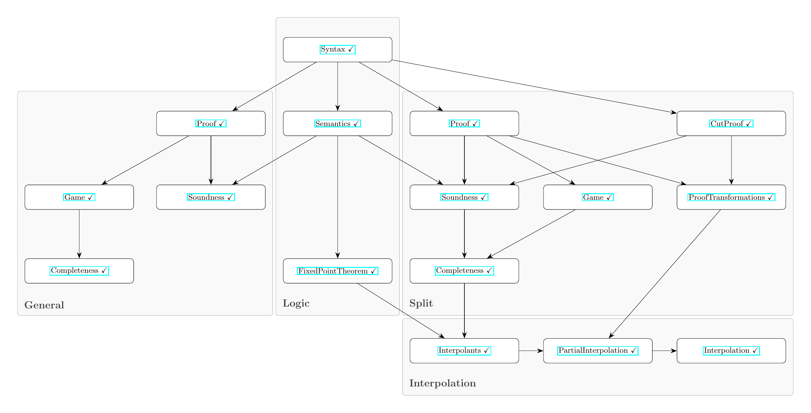

# Craig Interpolation for GL via Coalgebraic Proofs in Lean 4

## Overview

This project is a Lean 4 formalization of Craig interpolation for Gödel-Löb provability logic (GL). The proof of Craig interpolation is done proof-theoretically rather than semantically, building on a coalgebraic notion of proof for GL. This formalization accompanies my Master's thesis, which introduces the coalgebraic proof framework and studies it using the case study of GL along with two other proof systems.

## Status

- The report is *not* currently available.
- Everything is `sorry`-free except the work in `GL/Unused`.
- The documentation can be found [here](https://mgignoux.github.io/lean4-gl-coalgebras/docs/) (generated by doc-gen4)

## Module Dependency Overview

## References

- Proof systems for GL by Daniyar Shamkanov, on which we base our coalgebraic notion of proof:

  Daniyar Shamkanov. “Circular Proofs for Gödel-Löb Logic”. *Mathematical Notes* 96, no. 3 (Sept. 2014), pp. 575–585. <http://arxiv.org/abs/1401.4002>

- Soundness proof for Daniyar Shamkanov's GL proof system by Guillermo Menéndez Turata:

  Guillermo Menéndez Turata. “Cyclic Proof Systems for Modal Fixpoint Logics”. Ph.D. thesis, Institute for Logic, Language and Computation (Jan. 2024). <https://eprints.illc.uva.nl/id/eprint/2285>

- Construction of GL fixpoints by Lisa Reidhaar-Olson, used to prove the modal cases of the GL fixed-point theorem:

  Lisa Reidhaar-Olson. “A New Proof of the Fixed-Point Theorem of Provability Logic”. *Notre Dame Journal of Formal Logic* 31, no. 1 (1989), pp. 37–43. <https://doi.org/10.1305/ndjfl/1093635331>
